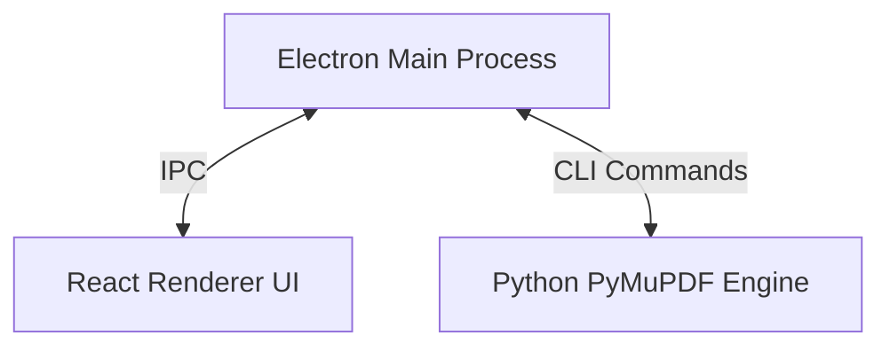

# PDF Master 1.0 📄✨

**PDF Master** is a premium, open-source, desktop PDF application built with a modern glassmorphism Dark Mode interface. It combines a high-performance **React + Vite** frontend running inside **Electron** with a robust, stateless **Python (PyMuPDF)** document engine.

---

## 🚀 Key Features

### 📄 Professional PDF Viewer
* **Intuitive Navigation**: Continuous scrolling, zoom-to-fit (page/width), and jump-to-page controls.
* **Smart Panels**: Integrated sidebar for page thumbnails and document bookmarks/outline.
* **Instant Search**: Find text instantly in documents using `Ctrl + F`.

### ✏️ Content Editing & Markup
* **Text Actions**: Find & replace specific text instances, append new text, or whiteout/delete content.
* **Annotation**: Add professional highlights, underlines, strikethrough lines, and sticky notes.
* **Image Insertion**: Embed images into specific pages at precise positions.

### 🛠️ Advanced Operations
* **Split PDF**: Extracts pages into individual PDF files. It automatically creates a new folder named after your PDF and places the pages inside it.
* **Merge PDFs**: Select multiple PDF documents and combine them into a single file.
* **Optimize & Compress**: Compress PDF file sizes for easy email sharing.
* **Watermarks & Styling**: Insert custom diagonal watermarks, headers, footers, or page numbers.
* **Security**: Password protect (encrypt) your PDFs or strip password protections.

---

## 🛠️ Setup & Running

Make sure you have [Node.js](https://nodejs.org/) and [Python 3](https://www.python.org/) installed.

### 1. Install Python Dependencies
```bash
pip install -r python_engine/requirements.txt
```

### 2. Install Node Dependencies
```bash
npm install
```

### 3. Run the App
```bash
npm start
```

---

## 🏗️ Architecture



* **Frontend**: React + Vite for a hardware-accelerated, responsive 60fps UI.
* **Runtime**: Electron for desktop shell, window management, and native file dialogs.
* **Backend**: Python + PyMuPDF (`fitz`) for fast, secure, and offline PDF processing.
